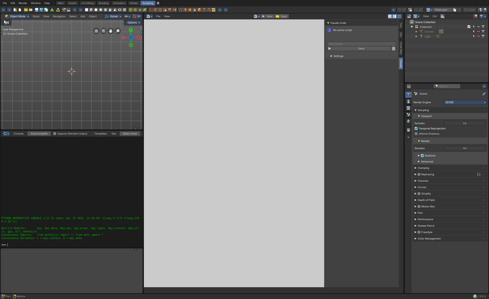

# Claude Code for Blender

A Blender/Bforartists extension that adds an AI-powered Python assistant to the Text Editor. Claude lives in the sidebar and can read your scripts, inspect the scene, execute code, and write scripts — all from a chat interface.



## Features

- **Text Editor integration** — panel in the N-panel sidebar, right next to your code
- **Auto-context** — the active script is automatically sent as context with every prompt
- **Agentic tool use** — Claude can inspect the scene, run code, and read/write scripts autonomously
- **Streaming responses** — see Claude's response as it's generated, non-blocking UI
- **Code actions** — Apply, Run, or Copy generated code with one click
- **Error self-correction** — failed code execution feeds errors back to Claude for automatic retry
- **Dual backend** — use Claude Code CLI (subscription) or Direct API (prepaid credits)
- **Zero dependencies** — uses only the `requests` library bundled with Blender
- **Auto API key detection** — reads your API key from macOS Keychain (shared with Claude Code CLI)

## Requirements

- Blender 4.2+ or Bforartists 4.2+ (uses the extensions manifest format)
- **CLI backend**: Claude Code CLI installed (`npm install -g @anthropic-ai/claude-code`) with active subscription
- **API backend**: Anthropic API key with prepaid credits

## Installation

### Development (symlink)

```bash
ln -s /path/to/this/repo/blender_claude \
  ~/Library/Application\ Support/Bforartists/5.1/extensions/user_default/blender_claude
```

### Manual

Copy the `blender_claude/` directory to your Blender extensions folder:
- **macOS**: `~/Library/Application Support/Blender/<version>/extensions/user_default/`
- **Windows**: `%APPDATA%\Blender Foundation\Blender\<version>\extensions\user_default\`
- **Linux**: `~/.config/blender/<version>/extensions/user_default/`

Then enable in **Edit > Preferences > Add-ons** — search for "Claude Code".

## Backends

The extension supports two backends, selectable in the Settings sub-panel:

### CLI Backend (default)

Uses your Claude Code CLI subscription (Pro/Max/Team). No API key needed — authentication is handled by the CLI.

```bash
npm install -g @anthropic-ai/claude-code
claude login
```

Multi-turn conversations are supported via CLI session resume. The CLI handles its own tool execution.

### API Backend

Uses prepaid API credits from [console.anthropic.com](https://console.anthropic.com). Supports agentic tool use (scene inspection, code execution, script read/write).

The extension looks for your API key in this order:
1. **Addon preferences** — set manually in Edit > Preferences > Add-ons > Claude Code
2. **Environment variable** — `ANTHROPIC_API_KEY`
3. **macOS Keychain** — auto-reads from the same entry Claude Code CLI uses

## Usage

1. Open the **Text Editor** in Blender
2. Press **N** to open the sidebar, click the **Claude** tab
3. Type a prompt and click **Send**

Examples:
- "Add a subdivision surface modifier to the active object"
- "Explain what this script does"
- "Write a script that creates a procedural city"
- "Fix the error on line 12"

### Settings

In the collapsible **Settings** sub-panel:
- **Backend** — CLI (subscription) or API (prepaid credits)
- **Model** — choose between Sonnet (default), Opus, or Haiku (API only)
- **Auto-include script** — automatically send the active script as context
- **Selection only** — send only selected text instead of the full script
- **Show tool calls** — display tool execution details in the chat (API only)

## Tools (API backend)

With the API backend, Claude has access to these Blender tools:

| Tool | Description |
|------|-------------|
| `get_scene_info` | Overview of all objects, selections, scene settings |
| `get_object_info` | Detailed mesh/material/modifier data for a specific object |
| `execute_python` | Run Python code in Blender with undo support |
| `read_text_block` | Read a script from the Text Editor |
| `write_text_block` | Create or update a script in the Text Editor |

The CLI backend uses Claude Code's own built-in tools instead.

## Architecture

```
CLI backend:
  User prompt → Background thread → claude -p (subprocess, NDJSON streaming)
                                          ↓
                                Text events → Queue → Timer → UI update

API backend:
  User prompt → Background thread → Anthropic API (SSE streaming)
                                          ↓
                                Text deltas → Queue → Timer → UI update
                                Tool calls  → Queue → Main thread execution → Results back to API
```

All Blender API calls happen on the main thread via `bpy.app.timers`. Both backends run in a background thread to keep the UI responsive.

## License

GPL-3.0-or-later
